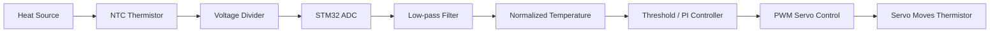
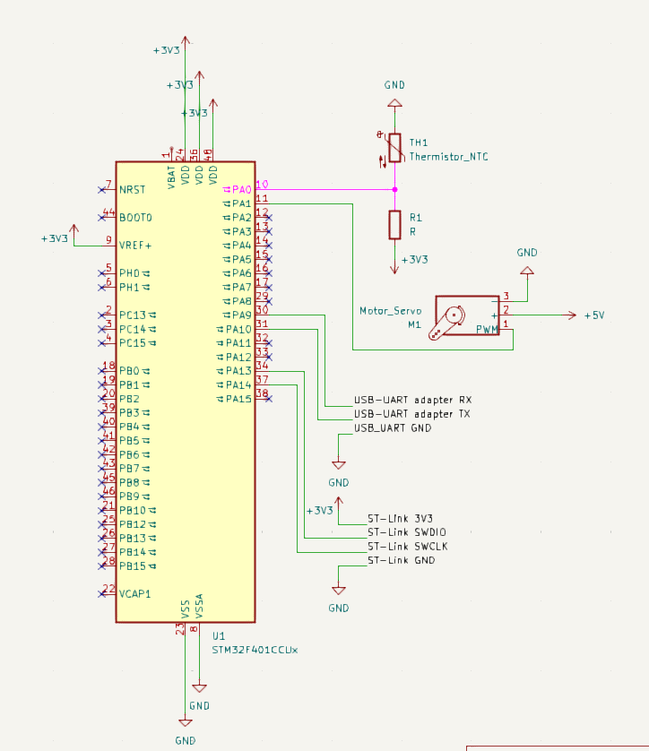
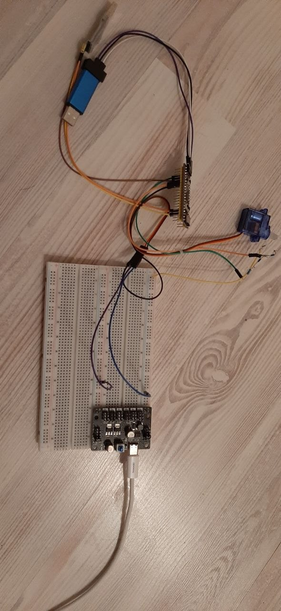
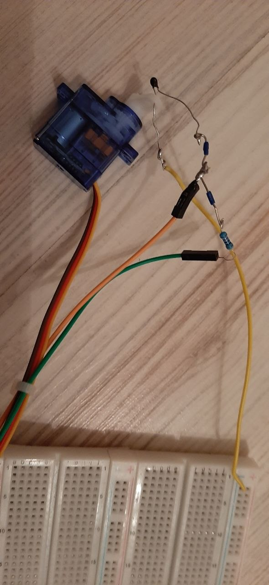

# STM32 Thermistor-Based Servo Thermal Protection System

## STM32 Thermistor-Based Servo Thermal Protection System is an STM32F401CCU6 embedded project for basic thermal protection using an NTC thermistor and a servo motor.

The system reads temperature changes from a 10k NTC thermistor through the STM32 ADC and moves the thermistor away from a heat source using a hobby servo. The project demonstrates sensor reading, PWM servo control, UART logging, threshold-based protection, and PI control.

The project is built with STM32CubeIDE and STM32 HAL. It focuses on embedded firmware structure, ADC signal processing, voltage divider behavior, servo calibration, closed-loop control, and practical hardware debugging.

## Features

* ADC reading from a 10k NTC thermistor voltage divider
* Normalized temperature calculation from filtered ADC values
* Low-pass filtering for more stable sensor readings
* Servo control using 50 Hz PWM
* Experimental servo pulse range calibration
* Threshold-based thermal protection with hysteresis
* PI control mode using a PID controller structure
* Emergency temperature override
* UART CSV logging for debugging and plotting
* Modular firmware structure
* Breadboard prototype
* Demo video showing thermal response

## Workflow

On startup, the STM32 initializes GPIO, UART, ADC, and TIM2 PWM.

The thermistor voltage is read through ADC1. Since the NTC thermistor is placed at the bottom of the voltage divider, the ADC value decreases when the temperature increases. The firmware converts this behavior into a normalized temperature value where higher values mean higher temperature.

The system can work in two control modes.

In threshold mode, the servo moves the thermistor away from the heat source when the temperature rises above a high threshold. It returns the thermistor closer only after the temperature falls below a lower threshold. This hysteresis prevents constant switching near one threshold.

In PI control mode, the firmware compares the measured normalized temperature with a target value. The controller output is mapped to a servo angle, so the servo gradually changes the thermistor position depending on the temperature error.

UART logging is used to output CSV data for debugging and later analysis.

## System Diagram



## Module Overview

| Module            | Responsibility                                                          |
| ----------------- | ----------------------------------------------------------------------- |
| `main.c`          | Application flow, peripheral initialization, control loop, UART logging |
| `thermistor.c/.h` | ADC reading, low-pass filtering, normalized temperature calculation     |
| `servo.c/.h`      | Servo initialization, PWM pulse control, angle-to-pulse mapping         |
| `control.c/.h`    | Threshold control with hysteresis                                       |
| `pid.c/.h`        | PI/PID controller structure and controller output calculation           |
| `adc.c/.h`        | STM32Cube-generated ADC configuration                                   |
| `tim.c/.h`        | STM32Cube-generated timer/PWM configuration                             |
| `usart.c/.h`      | STM32Cube-generated UART configuration                                  |
| `gpio.c/.h`       | STM32Cube-generated GPIO configuration                                  |

## Hardware Pinout

| Component           | Signal        | STM32F401CCU6 Pin | Notes                          |
| ------------------- | ------------- | ----------------- | ------------------------------ |
| NTC voltage divider | ADC node      | PA0               | ADC1_IN0                       |
| Servo               | PWM signal    | PA1               | TIM2_CH2                       |
| USB-UART adapter    | TX from STM32 | PA9               | USART1_TX                      |
| USB-UART adapter    | RX to STM32   | PA10              | USART1_RX                      |
| Onboard LED         | LED           | PC13              | Debug indication               |
| ST-Link             | SWDIO         | PA13              | Programming/debug              |
| ST-Link             | SWCLK         | PA14              | Programming/debug              |
| Servo power         | VCC           | External 5V       | Do not power from STM32        |
| Servo power         | GND           | Common GND        | Must be connected to STM32 GND |

## Hardware Components

| Component          | Description                                               |
| ------------------ | --------------------------------------------------------- |
| MCU board          | STM32F401CCU6 development board                           |
| Temperature sensor | 10k NTC thermistor                                        |
| Fixed resistor     | 10k resistor for voltage divider                          |
| Servo              | SG90 or compatible micro servo                            |
| Servo power supply | External 5V power source                                  |
| Programmer         | ST-Link v2                                                |
| UART adapter       | USB-to-TTL converter                                      |
| Heat source        | Soldering iron used carefully as a controlled heat source |
| Prototype          | Breadboard and Dupont wires                               |

## Wiring / Prototype Schematic



## Breadboard Prototype




## Video


## Thermistor Voltage Divider

The NTC thermistor is connected as a voltage divider:

```text
3.3V
 │
[10k fixed resistor]
 │
 ├── PA0 / ADC1_IN0
 │
[10k NTC thermistor]
 │
GND
```

With this wiring:

```text
Temperature increases → NTC resistance decreases → ADC voltage decreases → ADC raw value decreases
```

To make the control logic easier to understand, the firmware converts the ADC reading into a normalized temperature value:

```c
temp_norm = 1.0f - (adc_filtered / 4095.0f);
```

So:

```text
Higher temp_norm = higher temperature
```

## Threshold Control

Threshold control uses two temperature limits:

```text
TEMP_HIGH → move thermistor away from heat
TEMP_LOW  → move thermistor closer again
```

This creates hysteresis and prevents unstable switching near a single threshold.

Example behavior:

```text
Normal temperature:
    servo = near position

Temperature above high threshold:
    servo = away position

Temperature below low threshold:
    servo = near position
```

## PI Control

The PI controller compares the measured normalized temperature with a target value:

```c
error = temp_norm - target_temp_norm;
```

If the error is positive, the measured temperature is above the target and the servo moves the thermistor away from the heat source.

Current control mode:

```c
Kp = 1200.0f;
Ki = 5.0f;
Kd = 0.0f;
```

The controller is implemented using a PID structure, but the derivative term is disabled. Since the thermal system is slow and ADC readings can contain noise, the D term can cause unnecessary servo jitter.

So the current system is best described as:

```text
PI controller implemented inside a PID controller structure
```

## UART CSV Logging

The firmware sends CSV logs through UART.

Example format:

```csv
time_ms,target_temp,temp_norm,error,controller_output,servo_angle,emergency,adc_raw,adc_filtered
```

Example output:

```csv
1000,0.5400,0.5012,-0.0388,0.00,30.00,0,2042,2042.40
1100,0.5400,0.5301,-0.0099,0.00,30.00,0,1924,1925.33
1200,0.5400,0.5650,0.0250,50.00,80.00,0,1780,1781.20
1300,0.5400,0.5900,0.0500,120.00,150.00,1,1680,1682.10
```

These logs can be used to plot:

* normalized temperature vs time
* servo angle vs time
* control error vs time
* controller output vs time

## Usage

1. Flash the firmware to the STM32F401CCU6 board using ST-Link.
2. Connect the USB-UART adapter to USART1.
3. Open a serial terminal at 115200 baud.
4. Power the servo from an external 5V supply.
5. Make sure STM32 GND and servo power GND are connected together.
6. Place the thermistor near the heat source.
7. Carefully move the heat source closer to the thermistor.
8. Observe the servo moving the thermistor away from heat.
9. Record UART CSV logs if needed.

## Safety Notes

* Do not power the servo from the STM32 3.3V pin.
* Use a separate 5V supply for the servo.
* Connect STM32 GND and servo supply GND together.
* Do not apply more than 3.3V to the ADC input.
* Do not touch the thermistor directly to the soldering iron tip.
* Keep wires and the breadboard away from the hot part of the soldering iron.
* Do not use open flame for the final demo.
* Stop the test if the servo buzzes, overheats, or hits a mechanical limit.

## Known Limitations

* The project currently uses normalized temperature instead of real Celsius conversion.
* The servo position is estimated from PWM pulse width and is not measured with feedback.
* Cheap hobby servos may move with visible jitter or mechanical backlash.
* Servo motion smoothness depends on servo quality, power stability, filtering, and controller tuning.
* The thermistor response depends on distance from the heat source and airflow.
* The PI controller is tuned experimentally.
* The derivative term is disabled because it can amplify ADC noise.
* The prototype is built on a breadboard, so wiring and contacts may affect stability.

## Current Status

Implemented:

* STM32F401CCU6 project setup in STM32CubeIDE
* ST-Link flashing and debugging
* ADC thermistor reading
* Low-pass filtering
* Normalized temperature calculation
* UART CSV logging
* Servo PWM control
* Servo pulse range calibration
* Threshold control with hysteresis
* PI control mode
* Emergency temperature override
* Breadboard prototype
* Demo video

## Future Improvements

* Convert NTC readings to Celsius using the Beta equation
* Add Python script for CSV plotting
* Add smoother servo movement using slew-rate limiting
* Add UART command interface for changing control mode and gains
* Add button-based mode switching
* Add OLED display for live temperature and servo angle
* Improve mechanical mount for the thermistor
* Replace breadboard wiring with a soldered prototype
* Experiment with a filtered derivative term
* Add more plots to the README

## Repository Media Structure

Suggested media files:

```text
docs/
  wiring_schematic.png
  breadboard_prototype.jpg
  video/
    demo.gif
```